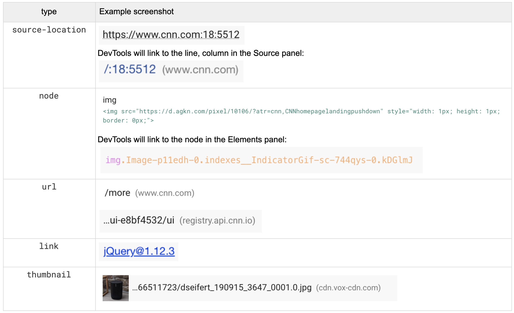

So, you want to create a new audit? Great! We're excited that you want to add to the Lighthouse project :) The goal of this 
document is to help you understand what constitutes as a "good" audit for Lighthouse, and steps you can follow if you want
to propose a new audit. 

## New audit principles

Lighthouse audits that surface in the report should:
- be applicable to a significant portion of web developers (based on scale and severity of impact) 
- contribute significantly towards making the mobile web experience better for end users. 
- not have a significant impact on our runtime performance or bundle size. 
- be new, not something that is already measured by existing audits. 
- be measurable (especially for performance audits) or have clear pass/fail states.
- be actionable - when failing, specific advice should be given. If the failure can be tied to a specific resource (a DOM element, script, line of code), use the appropriate detail type (see below). If multiple failures can occur for a page, return a table.
- not use 3rd party APIs for completing the audit check. 

## Actionability

1. Specific advice should be given if the audit fails. If an audit can fail in multiple ways, each way should have  specific guidance that the user should take to resolve the problem.
1. If the failure can be applied to a specific resource, use the appropriate detail type (see subsection).
1. If multiple failures can occur on a single page, show each (use a table - don't just return a binary score).

### Detail Types

An audit can return a number of different [detail types](https://github.com/GoogleChrome/lighthouse/blob/master/types/audit-details.d.ts).

| detail type               | resource              | notes                                  |
|---------------------------|-----------------------|----------------------------------------|
| `'node'`                  | DOM element           | set path to a devtoolsNodePath         |
| `'source-location'`       | Code Network Resource | use to point to specific line, column  |
| `'code'`                  | N/A; freeform         | render as monospace font `like this`   |
| `'url'`                   | Network Resource      | we will make it a pretty link          |
| `'thumbnail'`             | Image Resource        | same as above, but we show a thumbnail |
| `'link'`                  | -                     | arbitrary link / url combination       |
| `'text'\|'ms'\|'numeric'` | -                     |                                        |

### Granularity

The following detail types accept a `granularity` field:

- `bytes`
- `ms`
- `numeric`

`granularity` must either be a positive integer or power of 10. Some examples of valid values for `granularity`:

- 0.1
- 0.5
- 0.01
- 0.001
- 1

The value will be rounded to that nearest number. If not provided, the default behavior is equivalent to `0.001`.

<!--- https://docs.google.com/document/d/1KS6PGPYDfE_TWrRdw55Rd67P-g_MU4KdMetT3cTPHjI/edit#heading=h.32w9jjm4c70w -->


## Naming

### Audit ID

The audit ID should be based on the noun of the subject matter that it surfaces to the user.

The filename should match the audit ID.

**Policy**

- No verbs.
- No `no-` prefixes.
- Use the noun of the items it surfaces or concept it centers around.
- Adjective modifiers are acceptable and encouraged if the noun would be too broad without specificty.
- If an adjective modifier will result in describing either the passing or failing state, prefer the failing state.

**Examples**

- ~~no-vulnerable-dependencies~~ vulnerable-dependencies (no `no-`)
- ~~redirects-http~~ http-redirect (no verbs)
- ~~uses-long-cache-ttl~~ cache-headers (no verbs)
- ~~is-crawlable~~ crawlability (no verbs)
- ~~images~~ oversized-images (too broad)
- ~~used-css~~ unused-css (prefer failing state adjective)

### Audit Title / Failure Title

Audit titles vary based on report context and audit type.

- Opportunities should have an *imperative* `title` describing the action the developer should take to fix the issue.
- Standard audits should have both a *descriptive* `title` and a `failureTitle` that describe what the page is currently doing that resulted in a passing/failing state.

Opportunity `title`: "Compress large images"
Standard Audit `title`: "Page works offline"
Standard Audit `failureTitle`: "Page does not work offline"


## Process for creating a new audit

1. Scan the criteria we’ve laid out above. If you think the principles match with your proposed new audit, then proceed! 
1. Next step is to create an issue on GitHub with answers to the following questions: 
```
#### Provide a basic description of the audit
#### How would the audit appear in the report? 
<!-- How would the test look when passing? Would there be additional details available?
     How would the test look when failing? What additional details are available? 
     If the details are tabular, what are the columns?
     If not obvious, how would passing/failing be defined? -->
#### How is this audit different from existing ones?
#### What % of developers/pages will this impact? 
<!-- (Estimates OK, data points preferred) -->
#### How is the new audit making a better web for end users?
<!-- (Data points preferred) -->
#### What is the resourcing situation? 
<!-- Who will create the audits, write the documentation, and maintain both? -->
#### Any other links or documentation that we should check out?
```
3. Once the proposal is submitted, then Lighthouse team will take a look and followup. We will discuss possible implementation approaches, and associated runtime overhead.
With this new information we can better understand the impl cost and effort required and prioritize the audit into our sprint/roadmap. 
1. Depending on the prioritization, we'll then work with you to figure out the necessary engineering/UX/product details. 
